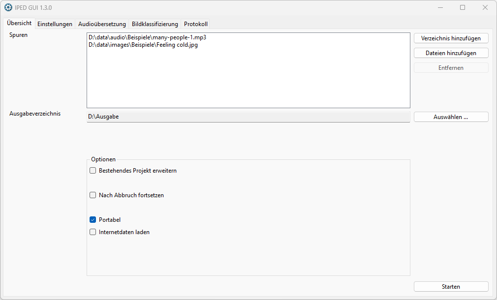

# IPED Gui

Dieses Programm bietet eine grafische Oberfläche für [IPED](https://github.com/sepinf-inc/IPED).
Es dient zur komfortablen Einstellung von IPED-Programmparametern und zum Starten und Protokollieren
von IPED-Programmdurchläufen.

[Hier geht es zu den Release Notes](RELEASENOTES.md)
